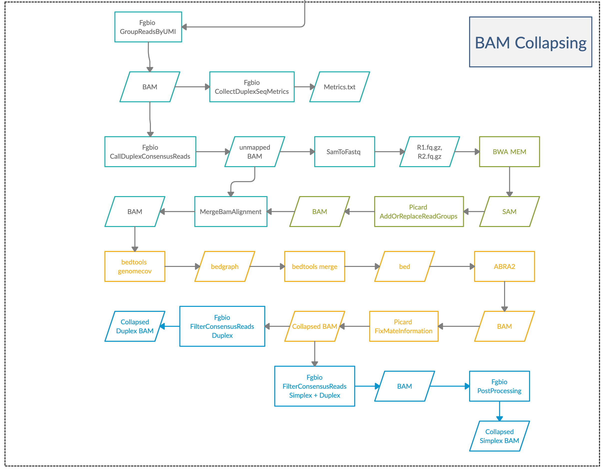

# BAM Collapsing

   

The bam collapsing workflow for MSK-ACCESS assay takes in a standard processed bam from standard processing workflow available [here](https://github.com/msk-access/uncollapsed_bam_generation).

-   Free software: Apache Software License 2.0
-   Documentation: [https://msk-access.gitbook.io/bam-collapsing](https://msk-access.gitbook.io/bam-collapsing)

## Features

Given a uncollapsed Unique Molecular Index (UMI) tagged BAM file:

1. Group Reads using UMI and generate a BAM file
2. Call Duplex Consensus Reads from the BAM and generate unmapped BAM file
3. Convert unmapped BAM to FASTQ and align and do standard BAM alignment
4. Merge the unmapped BAM with the aligned BAM this is the collapsed BAM.
5. Generate Duplex and Simplex BAM files

## Credits

- CMO cfDNA Informatics Team
- This package was created with Cookiecutter _and the `audreyr/cookiecutter-pypackage`_ project template.
